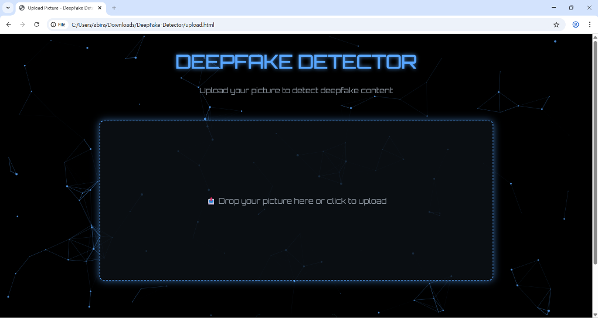
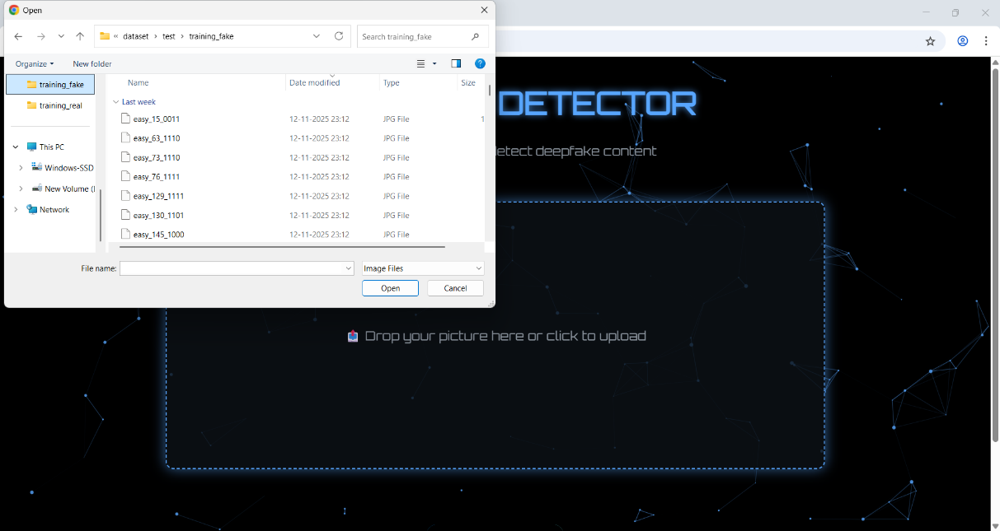
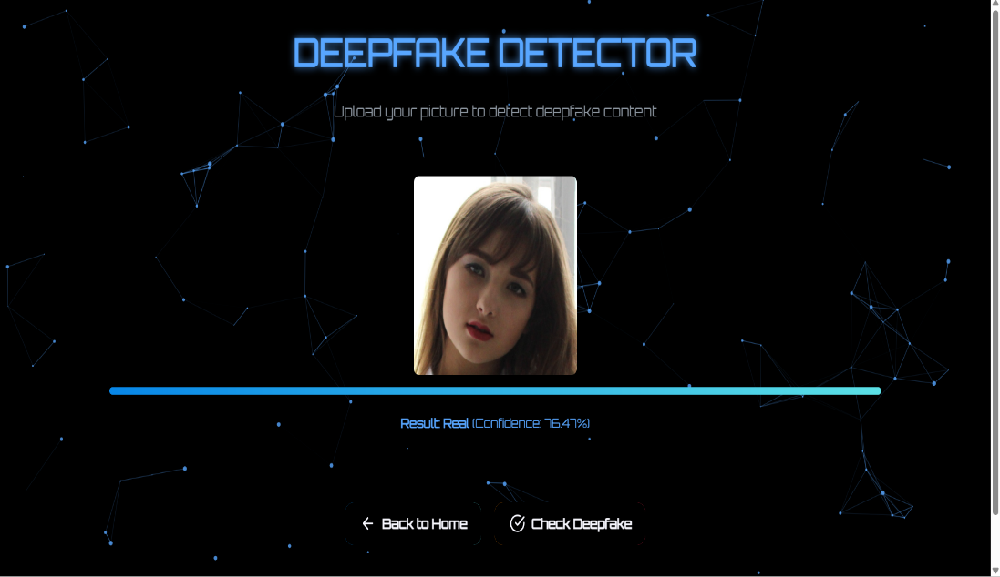
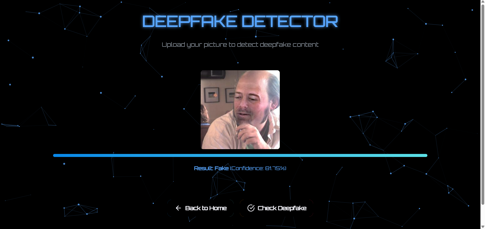

## 🕵️ DeepFake Image Detector – Expose the Fake

A deep learning–based web application that detects whether an uploaded image is **Real or Fake (DeepFake)**.  
The system combines a trained deep learning model with a clean, interactive frontend interface for easy usage.

## 📌 Project Overview
Deepfake technology can manipulate images to appear realistic, making it difficult to distinguish real content from fake.  
This project analyzes facial and visual features using deep learning to identify manipulated images with confidence scoring.

The application allows users to:
- Upload an image
- Analyze it using an AI model
- View the prediction result (Real/Fake) with confidence

## 🎯 Key Features
- 🖼️ Image upload with drag-and-drop support
- 🧠 Deep learning–based prediction
- 📊 Confidence score for predictions
- ⚡ Fast and user-friendly interface
- 🎨 Modern UI with interactive feedback

## 🛠️ Technologies Used
- **Python**
- **TensorFlow / Keras**
- **OpenCV**
- **NumPy**
- **HTML, CSS, JavaScript**
- **Deep Learning (CNN)**

## 📂 Project Structure
- DeepFake-Detector/
  │
  ├── real_and_fake_face/ # Original dataset (real & fake images)
  ├── dataset/ # Split dataset (80% train, 20% test)
  ├── model_training/ # Dataset split & model training scripts
  ├── images/ # Project screenshots
  ├── index.html # Landing page
  ├── upload.html # Upload & detection page
  ├── server.py # Backend logic
  ├── check.py  # Script to view model summary
  ├── evaluate_model.py # Model evaluation 
  └── requirement.txt # Dependencies

## 🖥️ Application Interface

### 🔹 Home Page
Landing page introducing the system and starting the detection process.

### 🔹 Image Upload Page
Users can upload images using drag-and-drop or file selection.

---

### 🔹 Image Selection
Local image selection for analysis.

---

### 🔹 Detection Result – Real Image
Output showing a **Real** image with confidence score.

---

### 🔹 Detection Result – Fake Image
Output showing a **Fake (DeepFake)** image with confidence score.

## ⚙️ How It Works
1. User uploads an image
2. Image is preprocessed (resize, normalization)
3. Deep learning model extracts features
4. Model predicts **Real or Fake**
5. Confidence score is displayed on UI

## 🚀 Future Enhancements
-Video-based deepfake detection
-Deployment on cloud
-Improved accuracy with larger datasets

## 👩‍💻 Author
Abirah Zaidi

  
